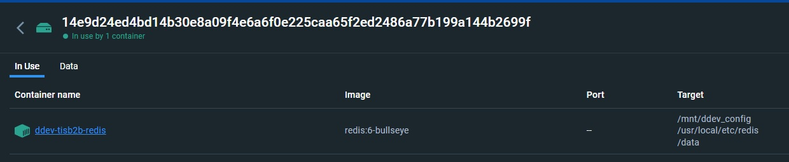

<div align="center">

# ddev-redis - Redis container for DDEV

[](https://github.com/ddev/ddev-redis/releases)
[](https://github.com/ddev/ddev-redis/actions/workflows/cron_tests.yml)


</div>

This repository provides [Redis](https://redis.com) container for [DDEV](https://ddev.readthedocs.io/).

It is based on [redis:6-alpine](https://hub.docker.com/layers/library/redis/6-alpine) docker image and [DDEV custom compose files](https://ddev.readthedocs.io/en/stable/users/extend/custom-compose-files/)

## Version 2 features

There are a lot of differences between [official](https://github.com/ddev/ddev-redis) addon and this one

| Feature           | v1               | v2                       |
| ----------------- | ---------------- | ------------------------ |
| Maximum Memory    | Unlimited        | 512Mb                    |
| Persistence       | No               | **Yes**                  |
| Image Size        | 112.9Mb          | 14.38Mb                  |
| Anonymous Volumes | On every restart | **NO**                   |
| Optimized config  | No               | **Yes**                  |

### Anonymous volumes - Wait, what?

Official redis docker image mounts an anonymous volume on `/data` because... reasons. That volume is recreated on every restart. This one mounts the persistence directory on `/data` and names it according to the project name, and gives it a proper label. This way, each DDEV project has it's own data volume, and data can persist accordingly



### Persistence?

Yes, persistence. This image is configured to persist data on `/data` volume. This means that if you stop the container, and start it again, the data will be there. This is useful for long-term caching of data, and for keeping the cache primed between ddev restarts.

## Installation

```
$ ddev get ddev/ddev-redis
$ ddev restart
```

> [!IMPORTANT]  
> Authentication is setup by default, and the password is `redis`.  
> If needed, you can auth with a username and password.  
> Username is `redis` as well.


## Configuration

### Redis Version
You can change the redis version by defining an environment variable using an `.env` file in the .ddev folder, or by exporting it in your shell.

```bash
export DDEV_REDIS_VERSION="7.2"
```
### Redis Server

Redis configuration files are split in the `.ddev/redis/conf` folder, you can modify them as you wish.  
Otherwise, plugin just works out of the box.


## Commands

Addon exposes the following commands

| Command           | Usage              | Description                        |
| ----------------- | ------------------ | ---------------------------------- |
| `redis`           | `ddev redis`       | Launches the **redis-cli**         |
| `redis *COMMAND*` | `ddev redis`       | Run an arbitrary redis-cli command |
| `redis-flush`     | `ddev redis-flush` | Clears all the Redis Databases     |
___

**Contributed and maintained by [@hussainweb](https://github.com/hussainweb) based on the original [ddev-contrib recipe](https://github.com/ddev/ddev-contrib/tree/master/docker-compose-services/redis) by [@gormus](https://github.com/gormus)**
**Co-maintained by [@stasadev](https://github.com/stasadev)**
**Overhauled and redesigned by [Oblak Studio](https://github.com/oblakstudio)**
